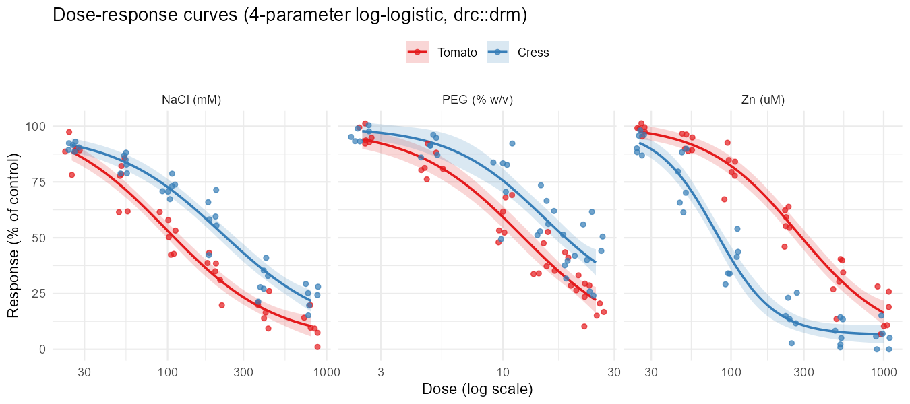
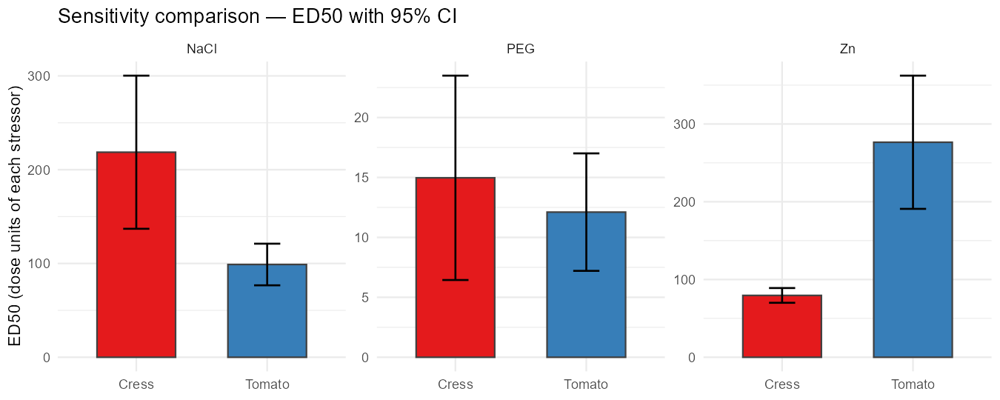

```{r setup, include = FALSE}
knitr::opts_chunk$set(echo = TRUE, message = FALSE, warning = FALSE,
                      fig.align = "center")
```

## Background

Portfolio piece — a synthetic recreation of a dose-response analysis I
helped run during a colleague's MSc project. The pipeline takes a
plate-level "% of control" response across a range of doses and three
stressors, fits a four-parameter log-logistic curve per
(species × stressor) using **`drc::drm`**, extracts **ED50** (a.k.a.
IC50) with delta-method 95 % CIs, and compares species sensitivity
across stressors.

## Simulated data

```{r simulate, results = "hide"}
source("R/01_simulate.R")
```

```{r show}
dat <- readRDS("data/dose_response.rds")
str(dat)
```

## Fitting

```{r fit, results = "hide"}
source("R/02_fit_drc.R")
```

```{r summ}
summary(fits$NaCl)
```

## Dose-response curves

```{r curves-img, echo = FALSE, out.width = "100%"}

```

Points are individual replicates; lines are predictions from
`LL.4()`; ribbons are 95 % confidence bands.

## ED50 comparison

```{r ed50-tab}
knitr::kable(ed50, digits = 2,
             caption = "ED50 with delta-method 95% confidence intervals.")
```

```{r ed50-img, echo = FALSE, out.width = "100%"}

```

Lower ED50 = the species is *more* sensitive to that stressor.

## Sanity check vs ground truth

Because the data was simulated, we know the true ED50 used by the
generator. Compare the fitted ED50 to the truth:

```{r truth-check}
truth <- readRDS("data/truth.rds")
truth_df <- do.call(rbind, lapply(names(truth), function(sp) {
  do.call(rbind, lapply(names(truth[[sp]]), function(st) {
    data.frame(species = sp, stressor = st,
               true_ED50 = unname(truth[[sp]][[st]]["e"]))
  }))
}))
merged <- merge(ed50, truth_df, by = c("species", "stressor"))
merged$rel_error_pct <- 100 * (merged$ED50 - merged$true_ED50) / merged$true_ED50
knitr::kable(merged, digits = 2)
```

Relative errors are typically within a few percent — the kind of
agreement we'd want before trusting the fit on real data.

## Pairwise tests across species (per stressor)

```{r ed-test}
lapply(fits, EDcomp, percVec = c(50, 50), interval = "delta")
```

Confidence intervals on the ED50 *ratio* between species, per stressor.
A CI not crossing 1 means the two species differ significantly in
sensitivity.

## Disclaimer

Numbers are simulated from log-logistic curves with hand-chosen
parameters and Gaussian noise. The repo demonstrates the **drc-based
fitting workflow**, not a finding about real chemicals or species.

```{r session}
sessionInfo()
```
